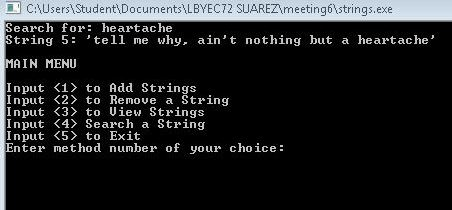
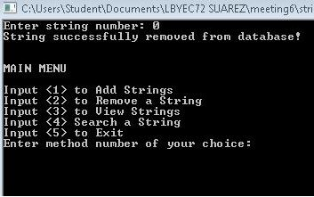

# lbyec72-ej1-p5-strings-joreleonardo
lbyec72-ej1-p5-strings-joreleonardo created by GitHub Classroom

INITIAL STRINGS WERE HARD-CODED IN THE PROGRAM;
ADD 0;
REMOVE 0;
VIEW 1;
SEARCH 1
(*0=not done, 1=done)

